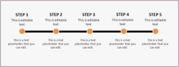

# Task Timeline Planner

A lightweight desktop app for planning and visualising tasks on an interactive timeline. Built with Python, Tkinter, and Matplotlib.



---

## Features

- **Visual timeline** — tasks render as labelled bars on a Gantt-style chart; milestones appear as diamond markers
- **Drag to resize** — grab either end of a task bar on the chart to shift its start or end date
- **Smart lane assignment** — overlapping tasks are automatically stacked into separate lanes so nothing is hidden
- **Today marker** — a dashed vertical line marks the current date on the chart
- **Milestone mode** — tick the checkbox to create a single-date milestone instead of a ranged task
- **Full CRUD** — add, edit, and delete tasks from the sidebar list or via right-click context menu
- **JSON persistence** — save and load project files in a portable `.json` format
- **Export** — save the current chart as a PNG or PDF image
- **Keyboard shortcuts** — `Ctrl+N` New, `Ctrl+O` Open, `Ctrl+S` Save

---

## Requirements

| Dependency | Version |
|---|---|
| Python | ≥ 3.10 |
| matplotlib | any recent |
| tkinter | bundled with Python |

Install dependencies:

```bash
pip install matplotlib
```

---

## Getting Started

```bash
# Clone the repo
git clone https://github.com/caryhp2-cell/TaskTimelinePlanner.git
cd TaskTimelinePlanner

# Run the app
python task_timeline_planner.py
```

---

## Usage

### Adding a Task

1. Type a name in the **Task Name** field.
2. Select a **Start Date** and **End Date** using the year / month / day dropdowns.
3. To create a milestone, tick **Milestone (single date)** — the end date picker will hide.
4. Click **Add Task**.

### Editing a Task

- Select a task in the list and click **Edit**, or right-click it and choose **Edit**.
- Update the name or dates in the dialog, then click **Save Changes**.

### Deleting a Task

- Select a task and click **Delete**, or right-click and choose **Delete**.

### Drag to Adjust Dates

- On the chart, hover near the left or right edge of a task bar.
- Click and drag to move the start or end date.

### Saving and Loading

- **File → Save** (`Ctrl+S`) saves to the current `.json` file.
- **File → Save As…** lets you choose a new file path.
- **File → Open…** (`Ctrl+O`) loads a previously saved project.

### Exporting the Chart

- **File → Export PNG…** saves the chart as a PNG image.
- **File → Export PDF…** saves it as a vector PDF.

---

## File Format

Projects are stored as plain JSON — a list of task objects:

```json
[
  {
    "id": "a1b2c3...",
    "name": "Design phase",
    "start_date": "2025-06-01",
    "end_date": "2025-06-14"
  },
  {
    "id": "d4e5f6...",
    "name": "Launch",
    "start_date": "2025-07-01",
    "end_date": "2025-07-01"
  }
]
```

---

## Building a Standalone Executable

The repo includes a PyInstaller spec file. To build a single `.exe`:

```bash
pip install pyinstaller
pyinstaller --onefile --windowed --name "TaskTimeline" task_timeline_planner.py
```

The output will be at `dist/TaskTimeline.exe`.

---

## License

MIT
